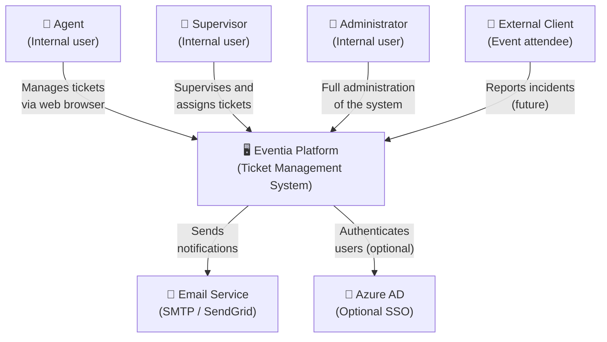
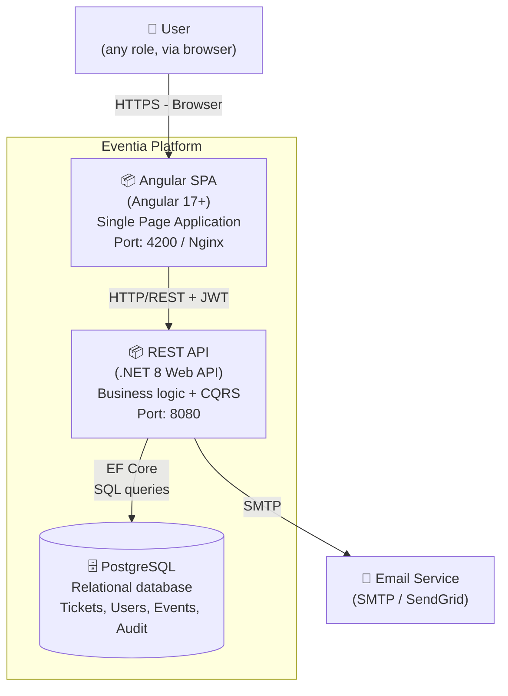
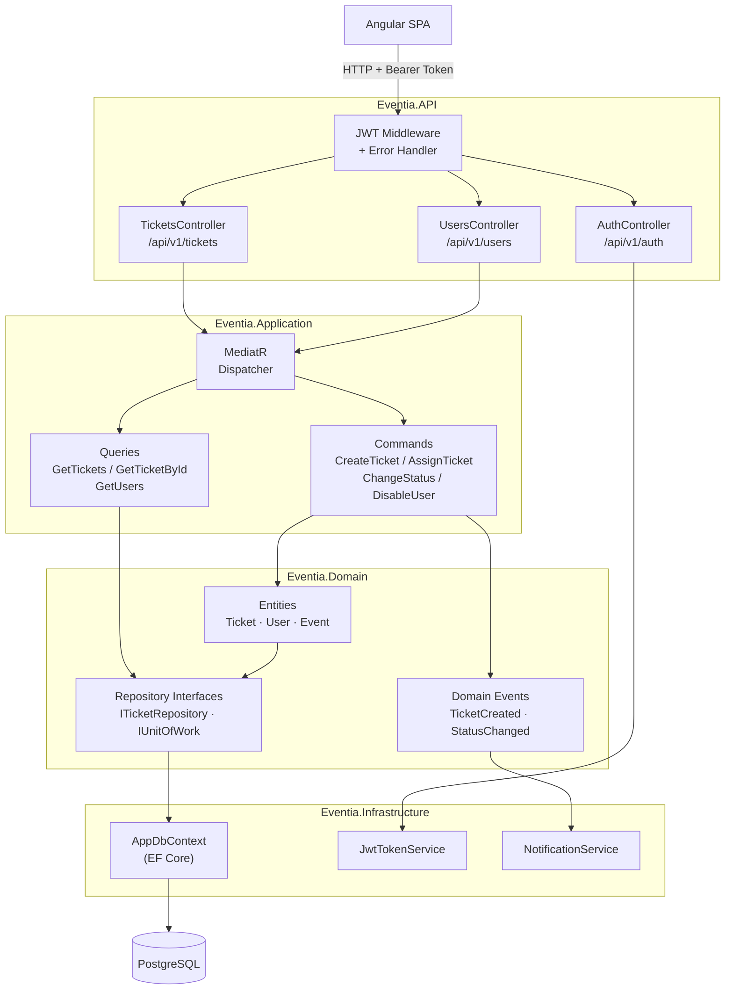

# C4 Architecture Diagrams — Eventia S.A.S.

---

## Level 1 — System Context

> Who uses the system and what external systems does it interact with?

---

## Level 2 — Containers

> What are the main deployable pieces of the system?

---

## Level 3 — Components (REST API)

> What are the main components inside the API container?

