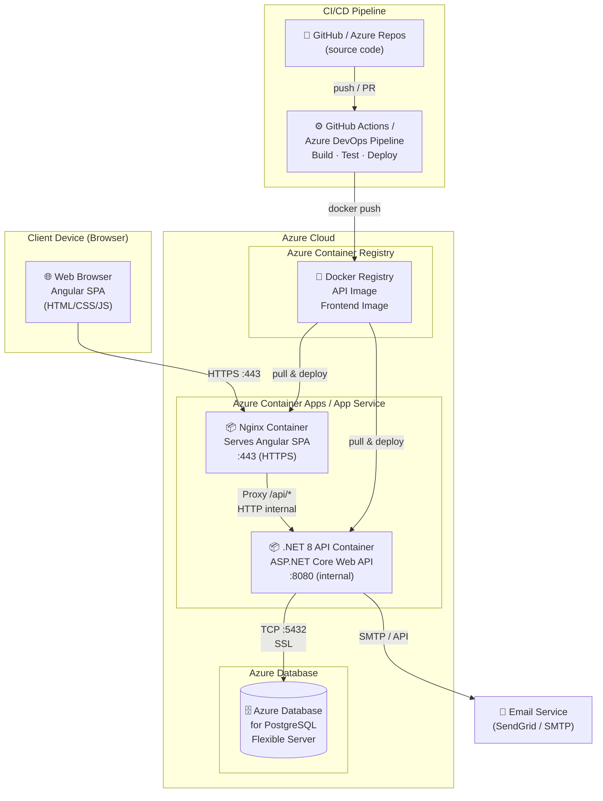

# UML Deployment Diagram — Eventia S.A.S.

---

## Deployment Overview



---

## Infrastructure Notes

| Component | Technology | Notes |
|---|---|---|
| Frontend hosting | Nginx container | Serves built Angular app, proxies `/api/*` to backend |
| Backend hosting | Azure Container Apps | Auto-scaling, managed HTTPS |
| Database | Azure Database for PostgreSQL Flexible Server | Managed, backups included |
| Container registry | Azure Container Registry | Stores versioned Docker images |
| CI/CD | GitHub Actions | Triggers on push to `main`; deploys to production |
| Secrets management | Azure Key Vault / GitHub Secrets | JWT secrets, DB connection strings |

## Deployment Flow

```
Developer pushes code to GitHub
        ↓
GitHub Actions triggers pipeline
        ↓
1. dotnet build + dotnet test  (.NET)
2. ng build --configuration=production  (Angular)
3. docker build → docker push (API + Frontend images)
        ↓
Azure Container Apps pulls new images
        ↓
Rolling update (zero downtime)
        ↓
Rollback available via previous image tag
```
