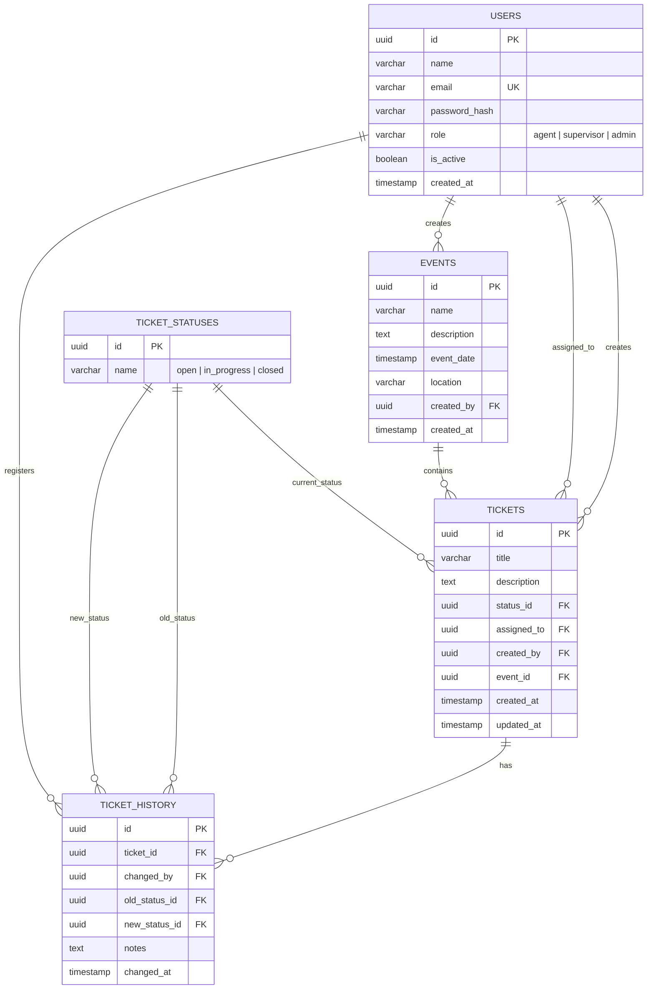

# Entity-Relationship Diagram — Eventia S.A.S.

## Database: PostgreSQL

## Entity Descriptions

| Entity | Description |
|---|---|
| **USERS** | System users with differentiated roles: agent, supervisor, administrator. Can be disabled without deletion. |
| **EVENTS** | Corporate or academic events that group related tickets. |
| **TICKETS** | Core unit of work. Linked to an event, a creator, and an assignee. Has a current status. |
| **TICKET_STATUSES** | Catalog of possible states: `open`, `in_progress`, `closed`. |
| **TICKET_HISTORY** | Full audit trail of every status change on a ticket, including who made it and when. |

## Key Design Decisions

- **UUIDs as primary keys**: avoids sequential ID exposure and simplifies distributed scenarios.
- **Soft delete for users**: `is_active` flag instead of physical deletion, preserving referential integrity.
- **Audit via TICKET_HISTORY**: every state transition is recorded, fulfilling the traceability requirement.
- **role as varchar on USERS**: simple and sufficient for the current three-role model; can evolve to a roles table if needed.
